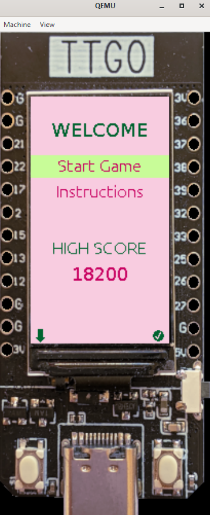
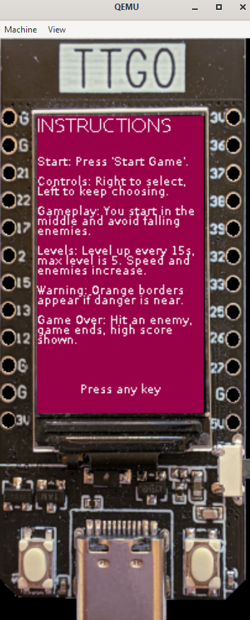

# GravityEscape
GravityEscape is a game developed using the ESP-IDF framework for the ESP32 platform. The game involves enemies that spawn from the top of the screen and move downwards. The player must avoid these enemies to score points.

## Files
- **CMakeLists.txt**: Configuration file for CMake, used to manage the build process.
- **partitions.csv**: Defines the partition layout for the ESP32 flash memory.
- **platformio.ini**: Configuration file for PlatformIO, sepcifying environments, build options, and library dependencies.
- **sdkconfig.defaults**: Default configuration settings for the ESP-IDF project.
- **sdkconfig.emulator**: Configuration settings for running the project in an emulator.
- **src/game.c**: Contains the main game logic, including enemy spawning, player movement, and collision detection.
- **src/graphics3d.c**: Handles the 3D graphics rendering.
- **src/input_output.c**: Manages input and output operation.
- **src/instructions.c**: Displays game instructions.
- **src/score.c**: Displays the score after the game ends.
- **src/main.c**: Entry point of the application.

## Running the Emulator
The emulator should work on Windows, Linux, and OSX. To run the emulator, use the following commands:  
**pio run -e emulator -t upload**

## Screenshots 

*Main Menu View*

*Instruction View*

## Credits
This project uses some classes and code from [TTGODemo](https://github.com/a159x36/TTGODemo)  

